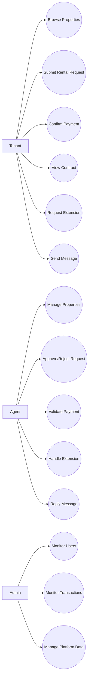
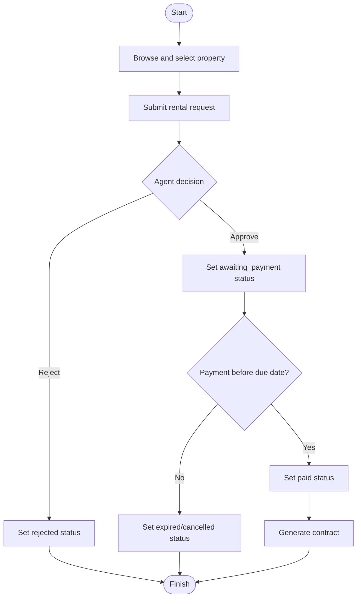
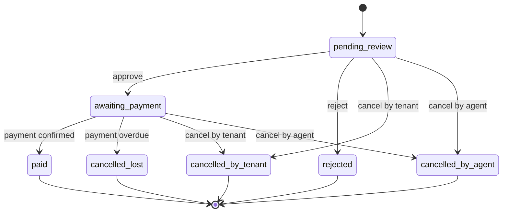
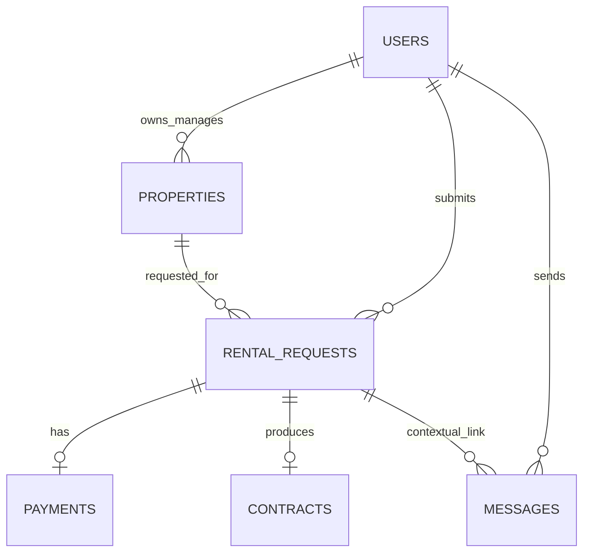

# Chapter 3 System Analysis and Design

Chapter 3 presents the system analysis and design for the proposed web-based house rental management system. This chapter describes the system requirements, architecture, process modeling, and database structure that guide the implementation. It also explains the design rationale for role governance, workflow control, and transaction data consistency.

## 3.1 System Overview
This chapter explains the analysis and design of the web-based house rental management system developed in this study. The system is designed to integrate property listing, tenant-side search and request submission, approval workflow, payment confirmation, contract generation, contract extension, and contextual messaging in one platform. The main objective of the design is to improve process consistency, role accountability, and transaction traceability.

The system serves three primary actors: `admin`, `agent`, and `tenant`. Each actor interacts with the same data domain through role-based permissions and status-controlled transitions to reduce conflicting operations.

## 3.2 Functional Requirements
The functional requirements are grouped by core modules:

1. Authentication and authorization module:
1. User login and role identification.
2. Access restriction by role (admin/agent/tenant).

2. Property management module:
1. Agent can create, update, and manage property data and availability.
2. Tenant can browse and filter available properties.

3. Rental request and transaction module:
1. Tenant can submit rental requests for selected properties.
2. Agent can approve or reject requests.
3. System enforces request status transitions.
4. Tenant can confirm payment within due-date constraints.

4. Contract and extension module:
1. System generates rental contract data after transaction completion.
2. Tenant can request contract extension.
3. Agent can approve or reject extension requests.

5. Messaging module:
1. Tenant and agent can exchange contextual messages linked to related records.

6. Administration module:
1. Admin can monitor users, properties, requests, payments, and contracts.

## 3.3 Non-Functional Requirements
The non-functional requirements include:

1. Security:
1. Role-based access and route-level protection.
2. Controlled status transitions to prevent unauthorized state changes.

2. Reliability:
1. Consistent transaction updates using guarded workflow logic.
2. Data persistence in a relational database.

3. Usability:
1. Clear role-specific interfaces.
2. Search and request flow that can be completed with minimal steps.

4. Maintainability:
1. Modular Laravel architecture for future feature extension.
2. Separated business logic for easier testing and refactoring.

## 3.4 System Architecture
The system follows a web application architecture:

1. Presentation layer:
1. Blade-based web interface for admin, agent, and tenant.

2. Application layer:
1. Laravel controllers and services handling business processes.
2. Validation and role checks for each action.

3. Data layer:
1. MySQL-based relational schema for users, properties, rental requests, payments, contracts, and messages.

This structure aligns with common web-based rental system implementations and iterative development practices reported in prior studies (Obse, 2025; Riyanti et al., 2024).

## 3.5 Use Case Design
At use-case level:

1. Tenant use cases:
1. Register/login.
2. Search properties.
3. Submit rental request.
4. Upload/confirm payment.
5. View contract and extension status.
6. Send contextual messages.

2. Agent use cases:
1. Manage property records.
2. Review and decide rental requests.
3. Validate payment and manage contract flow.
4. Reply to tenant messages.

3. Admin use cases:
1. Monitor platform-wide operations and user activities.
2. Manage system-level records.

## 3.6 Activity Flow Design
The core activity flow is:

1. Tenant searches and selects a property.
2. Tenant submits rental request.
3. Agent reviews request and sets decision.
4. If approved, system opens payment window with due-date.
5. Tenant confirms payment.
6. System records completed transaction and enables contract output.
7. Optional extension follows a similar approval-payment-validation cycle.

The design emphasizes controlled transitions to avoid overlapping decisions and inconsistent outcomes.

## 3.7 Database Design
The conceptual entities include:

1. `users` (account and role data).
2. `properties` (listing and availability data).
3. `rental_requests` (request lifecycle records).
4. `payments` (payment confirmation records).
5. `contracts` (initial and extended contract outputs).
6. `messages` (contextual communication logs).

Relations are designed to preserve traceability from a property to requests, transactions, and contracts.

## 3.8 Design Rationale
Three design priorities are adopted:

1. Workflow control:
Status-driven process design is used to reduce manual ambiguity and improve transaction consistency.

2. Role governance:
Role separation is used to align responsibility and reduce unauthorized operations, consistent with web access-control findings (Le et al., 2022).

3. Data readiness for analysis:
Structured transaction and interaction records are maintained to support future decision support and operational analysis (Setiawan et al., 2026; Wang et al., 2024).

## 3.9 System Diagrams
This section presents core diagrams used to describe actor interaction, workflow logic, state control, and data structure.

### 3.9.1 Use Case Diagram (Conceptual)

### 3.9.2 Activity Diagram (Main Rental Flow)

### 3.9.3 State Transition Diagram (Rental Request)

### 3.9.4 Entity Relationship Diagram (Conceptual)

## References (Chapter 3 Draft)

Le, H. T., Shar, L. K., Bianculli, D., Briand, L. C., & Nguyen, C. D. (2022). Automated reverse engineering of role-based access control policies of web applications. *Journal of Systems and Software, 184*, 111109. https://doi.org/10.1016/j.jss.2021.111109

Obse, Z. G. (2025). Addis Ababa online home rental management system, Ethiopia. *Journal of Electrical Systems and Information Technology, 12*(1). https://doi.org/10.1186/s43067-025-00220-1

Riyanti, A., Taryana, T., Dirgantoro, G. P., & Gunawan, I. M. A. O. (2024). Development of rental application using prototyping method. *TECHNOVATE: Journal of Information Technology and Strategic Innovation Management, 1*(2), 69-80. https://doi.org/10.52432/technovate.1.2.2024.69-80

Setiawan, A. B., Yuniar, E., Hermansyah, M., Mujiono, M., & Ariyadi, D. J. (2026). Decision support system for selecting the best rental house with Weight Product in Sidokare District, Sidoarjo Regency. *G-Tech: Jurnal Teknologi Terapan, 10*(1), 536-548. https://doi.org/10.70609/g-tech.v10i1.8865

Wang, Y., Livingston, M., McArthur, D. P., & Bailey, N. (2024). Enhancing our understanding of short-term rental activity: A daily scrape-based approach for Airbnb listings. *PLOS ONE, 19*(2), e0298131. https://doi.org/10.1371/journal.pone.0298131
